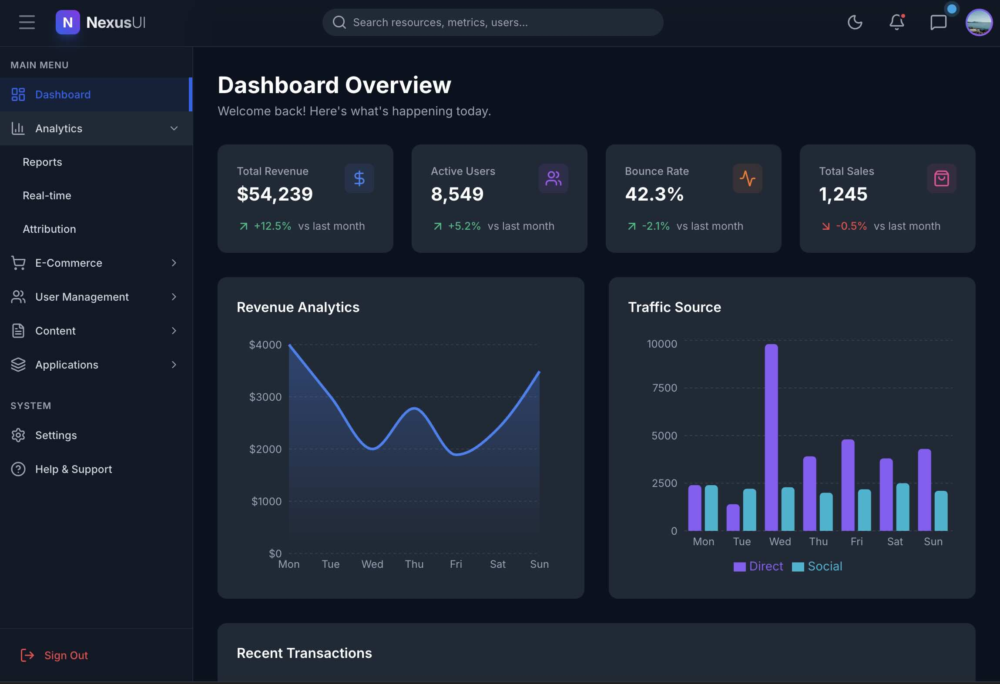

# Web App Template Contains - Nexus UI

- Header bar 
- Left Side Collapsible Tree Menu
- Right Side Chat Assistant - Collapsible
- Icon at the Header Bar right side, Day & Night, Chat, Notifications, User Profile
- Dashboard with Widgetsm Charts and Table
 
## Prompt

```
Please Create a Web App with Responsive UI, that contains a
1. Left Side Panel (Collapsible to left) with Menus in Tree Model and a
2. Right Side Panel with a a Chat Assistant Collapsible to the Right.
3. The Top Bar contains the Logo, Product Name on the left and a
4. Day & Night Theme Icon and a User Profile Icon on the right side,

```

## App Responsive UI




