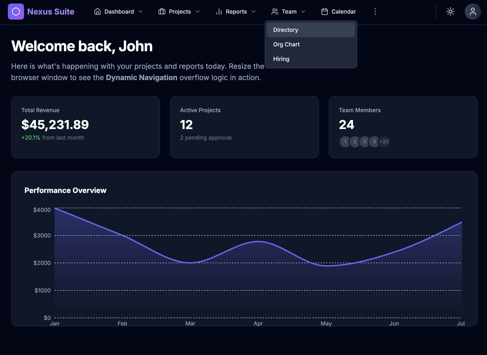

# Web App Template Contains - Nexus Suite UI

- Header bar 
- Menus and Sub Menus in the Header Panel
- Icon at the Header Bar right side, Day & Night, User Profile
- Dashboard with Widgets & Charts 
 
## Prompt

```
Please Create a Web App with Responsive UI, that contains a
1. Top Bar contains the Logo, Product Name on the left and a
2. Day & Night Theme Icon and a User Profile Icon on the extreme right side and a
3. Drop Down Menus and Sub Menus from the Header Panel on the left side of the Icons (mentioned above).
4. When mouse is over the Top Level Menu, it should show its sub menus. When Mouse is over a Sub Menu it should show its sub menus.
5. The Menus are collapsed to the Stack Icon on the Left side only if Single Menu with More Menus (3 dots vertical icon) on the Header panel cant be rendered.
6. As the number of Main Menus are more than the width of the UI, there should be a 3 Vertical Dot button to show the rest of the Top Level Menus.

```

## App Responsive UI




